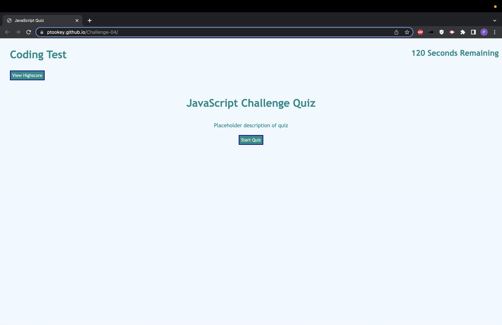

# Challenge-04

## Description

This was the fourth challenge of the bootcamp, having students construct a quiz from scratch. While partaking in this challenge one can get very familiar with javascript and how to locally store data. The logic puzzles used to create the project is useful and seeing how to refactor the code to make it simpler is fun as well.

## Usage

This can be used to test a students knowledge later on.

## Link to Pages

[Challenge-04](https://ptookey.github.io/Challenge-04/)

## Screenshot of Page

